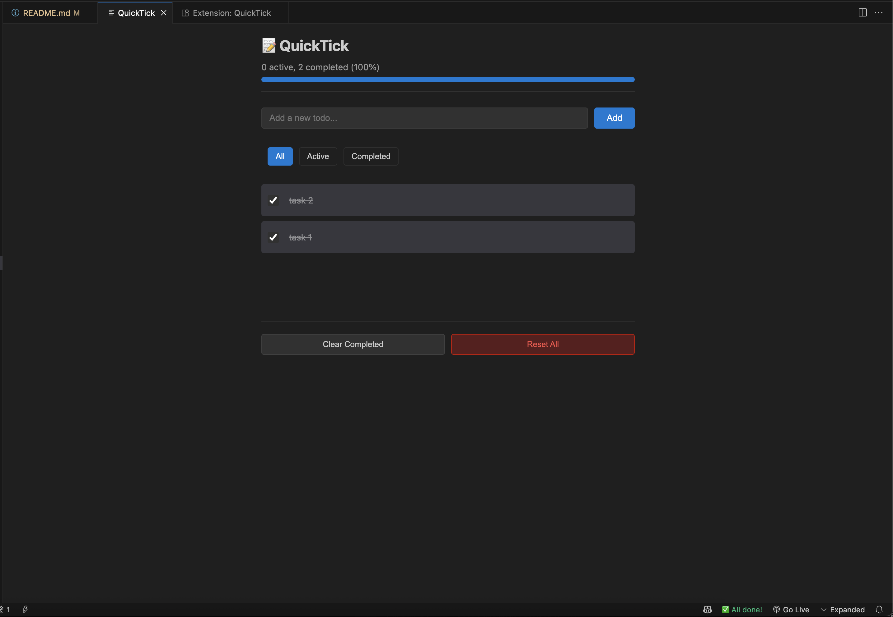

# 📝 QuickTick - Project Todo Manager for VS Code

> Your personal todo list that lives with your code. A VS Code extension for project-specific task management with persistent storage.

## 📸 Screenshots

### Todo Panel with Active Tasks

**Look for the `📝 Todos (n)` indicator in the bottom-right corner of your status bar. Click it to open the todo panel.**


*The extension shows your todos in an interactive panel with checkboxes, progress bar, and filter options*

### All Tasks Completed

**When all tasks are done, the status bar shows `✅ All done!` with a celebration animation**



*The panel displays a 100% progress bar and completed status when all todos are finished*

## 🚀 Getting Started

### Where to Find QuickTick

After installing QuickTick, look at the **bottom-right corner of your VS Code status bar**. You'll see:

- `📝 Todos (0)` - When you have no tasks
- `📝 Todos (5)` - Shows number of pending tasks
- `✅ All done!` - When all tasks are completed

**Click this indicator to open the todo panel!**

## ✨ Features

- **📌 Project-Specific**: Each project has its own todo list
- **💾 Persistent Storage**: Todos survive VS Code restarts
- **📊 Progress Tracking**: Visual progress bar with completion percentage
- **🎯 Smart Filters**: View All, Active, or Completed todos
- **✏️ Inline Editing**: Double-click any todo to edit
- **📈 Status Bar**: Always-visible todo count indicator
- **📤 Export**: Save your todos as Markdown
- **⚡ Keyboard Shortcuts**: Quick access with `Alt+T` / `Cmd+T`

## 🚀 Installation

### From VS Code Marketplace (Coming Soon)

1. Open VS Code
2. Press `Ctrl+P` / `Cmd+P`
3. Type `ext install quicktick`
4. Press Enter

### From Source (Development)

```bash
# Clone the repository
git clone https://github.com/sayedabdulkarim/QuickTick.git
cd QuickTick

# Install dependencies
npm install

# Compile TypeScript
npm run compile

# Open in VS Code
code .

# Press F5 to run in development mode
```

## 📖 Usage

### Opening the Todo Panel

- **Keyboard**: Press `Alt+T` (Windows/Linux) or `Cmd+T` (Mac)
- **Status Bar**: Click `📝 Todos (n)` in the bottom-right corner
- **Command Palette**: Press `Ctrl+Shift+P` and type "QuickTick: Toggle"

### Managing Todos

1. **Add Todo**: Type in the input field and press Enter
2. **Check/Uncheck**: Click the checkbox to mark as complete
3. **Edit**: Double-click the todo text to edit inline
4. **Delete**: Hover and click the trash icon
5. **Filter**: Use All/Active/Completed buttons to filter view

### Keyboard Shortcuts

- `Alt+T` / `Cmd+T` - Toggle todo panel
- `Alt+Shift+T` / `Cmd+Shift+T` - Quick add todo
- `Escape` - Close panel (when focused)
- `Enter` - Add todo (in input field)

## 🎯 Features Breakdown

### Core Functionality

- ✅ Add, edit, delete todos
- ✅ Mark todos as complete/incomplete
- ✅ Filter by status (All/Active/Completed)
- ✅ Clear completed todos
- ✅ Reset all todos
- ✅ Export as Markdown

### User Interface

- ✅ Side panel with modern UI
- ✅ Status bar with todo count
- ✅ Progress bar with percentage
- ✅ Celebration animation at 100%
- ✅ Color-coded status indicators
- ✅ Dark/Light theme support

### Storage & Persistence

- ✅ Project-specific todo lists
- ✅ Automatic save on every change
- ✅ Survives VS Code restarts
- ✅ Workspace state storage

## ⚙️ Configuration

Access settings through VS Code Settings or add to your `settings.json`:

```json
{
  // Where to store todos
  "quicktick.storageLocation": "workspace",

  // Panel position
  "quicktick.panelPosition": "right",

  // Show completed todos
  "quicktick.showCompletedTodos": true,

  // Enable animations
  "quicktick.enableAnimations": true
}
```

## 🛠️ Development Setup

### Prerequisites

- Node.js (v16 or higher)
- VS Code (v1.74.0 or higher)
- TypeScript (v4.9 or higher)

### Project Structure

```
quicktick/
├── src/
│   ├── extension.ts        # Main extension entry
│   ├── todoProvider.ts     # Todo data management
│   ├── statusBar.ts        # Status bar integration
│   └── webviewPanel.ts     # Panel controller
├── webview/
│   ├── script.js          # Panel JavaScript
│   └── style.css          # Panel styles
├── out/                   # Compiled JavaScript
├── package.json          # Extension manifest
├── tsconfig.json         # TypeScript config
└── README.md            # Documentation
```

### Development Commands

```bash
# Install dependencies
npm install

# Compile TypeScript
npm run compile

# Watch mode (auto-compile)
npm run watch

# Run tests
npm test

# Package extension
npm run package

# Lint code
npm run lint
```

### Testing Locally

1. Open the project in VS Code
2. Press `F5` to launch Extension Development Host
3. In the new window:
   - Look for `📝 Todos (0)` in the status bar
   - Click it or press `Cmd+T` to open the panel
   - Add some todos and test features

## 📊 Status Bar States

The status bar indicator changes based on your todos:

- `📝 Todos (0)` - No todos yet (gray)
- `📝 Todos (5)` - Active todos (white)
- `⚠️ Todos (7)` - Many pending (yellow warning)
- `🔥 Todos (12)` - Too many pending (red alert)
- `✅ All done!` - All completed (green)

## 📤 Export Format

Export your todos as Markdown with formatting:

```markdown
# QuickTick Todos

_Exported on 12/3/2024, 10:30 AM_

## Active Todos

- [ ] Fix authentication bug
- [ ] Update documentation
- [ ] Review PR #123

## Completed Todos

- [x] Setup project structure _(completed 12/2/2024)_
- [x] Add unit tests _(completed 12/2/2024)_
```

## 🐛 Known Issues

- WebView state resets if VS Code crashes unexpectedly
- Large todo lists (>500 items) may impact performance

## 📝 Changelog

### Version 0.0.1 (Initial Release)

- Project-specific todo management
- Persistent storage per workspace
- Status bar integration
- Interactive WebView panel
- Markdown export
- Keyboard shortcuts
- Dark/Light theme support

## 🚀 Roadmap

### Phase 2 Features

- [ ] Due dates for todos
- [ ] Priority levels (High/Medium/Low)
- [ ] Tags and categories
- [ ] Search functionality
- [ ] Import from Markdown
- [ ] Multiple todo lists per project
- [ ] Sync across devices (optional cloud sync)

### Phase 3 Features

- [ ] GitHub Issues integration
- [ ] Team collaboration features
- [ ] Time tracking
- [ ] Recurring todos
- [ ] Templates for common tasks
- [ ] Statistics and analytics

## 🤝 Contributing

Contributions are welcome! Please feel free to submit a Pull Request.

1. Fork the repository
2. Create your feature branch (`git checkout -b feature/AmazingFeature`)
3. Commit your changes (`git commit -m 'Add AmazingFeature'`)
4. Push to the branch (`git push origin feature/AmazingFeature`)
5. Open a Pull Request

## 📄 License

This project is licensed under the MIT License - see the [LICENSE](LICENSE) file for details.

## 🙏 Acknowledgments

- Built with the VS Code Extension API
- Inspired by the need for simple, project-focused task management
- Thanks to all contributors and users

## 💬 Support

- **Issues**: [GitHub Issues](https://github.com/sayedabdulkarim/QuickTick/issues)
- **Discussions**: [GitHub Discussions](https://github.com/sayedabdulkarim/QuickTick/discussions)

---

**Made with ❤️ by Sayed Abdul Karim**

_Keep your todos where your code lives with QuickTick_ 📝
